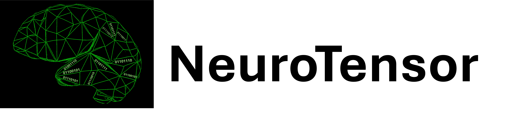
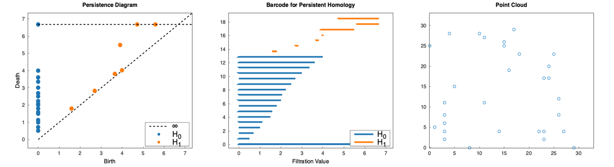
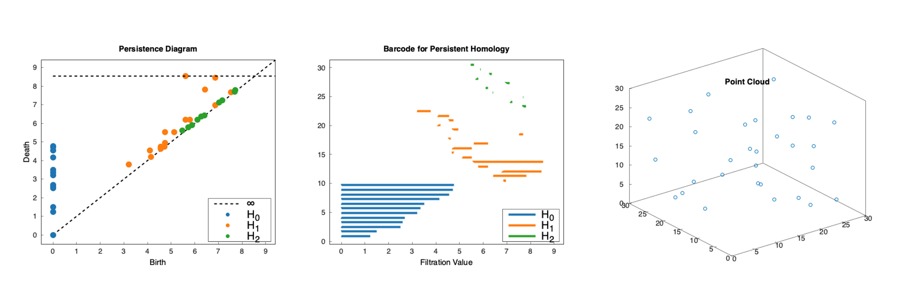

<hr>

Version: v0.1.5

NeuroTensor is a tensor framework that has a tda and autograd wrapper built in. The syntax follows PyTorch's closely, but in C++. Current version is 0.1.5 and there is still much to come for added support and testing. This is an early beta version, with an end goal being a framework for computational neuroscience tools.


## Tensors and NeuroTensor

The Tensor class is seperate from the autograd. It is a standalone wrapper, that uses the `nt::DType` enum to switch between different types, and has a wide range of function support. A detailed documentation is to come.

This is an example function pulled from the tests file, showing how it is able to work:

```C++
//some basic syntax and functionality
nt::Tensor t = nt::functional::randn({3,4,5}); //creates a 3x4x5 float tensor
t[1] += 1;
t[t < 0.01] *= -1;
nt::Tensor t2 = t[2];
t2[t2 > 0].exp_(); //also modifies t
t2 = t2.to(nt::DType::Double);
std::cout << t2 << std::endl;

```

## Creating Custom Layers

There is an `nt::Layer` class with a built-in reflection wrapper. Each custom layer or model must be a class that inherits from `nt::Module`. Gradients are automatically tracked, but can be manually created as well by overloading the `backward` function. The `eval` function can also be overloaded if there are differences in the way that the layer or model behaves based on if it is in `eval` mode beyond just not tracking the gradient. 

The idea behind the API was to make it as simple and flexible as possible, while also allowing some of the principles behind c++ to shine through. Below is an example involving as many or as few arguments as needed, and showing the ability to use things such as references. Of course pointers are also allowed. Currently, default parameters and named parameters are not supported. Support for default parameters are currently being added. 

Below is an example making and usign custom layers:

```C++

#include <nt/ai.h>
#include <nt/Tensor.h>


class TimeAwareHiddenLayer : public nt::Module{
    int64_t _input_size, _hidden_size;
    public:
        nt::Layer input_proj, hidden_proj, time_proj, output_proj;
        TimeAwareHiddenLayer(int64_t input_size, int64_t hidden_size)
        :_input_size(input_size),
        _hidden_size(hidden_size),
        input_proj(nt::layers::Linear(ntarg_(in_channels) = input_size, ntarg_(out_channels) = hidden_size)),
        hidden_proj(nt::layers::Linear(hidden_size, hidden_size)),
        time_proj(nt::layers::Linear(1, hidden_size)), // Scalar time which is going to be a tensor of shape (1,1)
        output_proj(nt::layers::Linear(hidden_size, hidden_size))
        {}

        // Automatically tracks if references are expected
        // For the nt::Scalar, if a scalar rvalue is passed, will automatically convert it to an nt::Scalar
        nt::TensorGrad forward(const nt::TensorGrad& x, nt::TensorGrad& h, nt::Scalar t){
            // Params: x: input (const reference)
            //         h: reference to hidden hidden
            //         t: 00:5
            
            nt::TensorGrad time(nt::Tensor(t).view(1,1), false); // The layer class expects an nt::TensorGrad argument
            
            nt::TensorGrad x_proj = this->input_proj(x);
            nt::TensorGrad h_proj = this->hidden_proj(h);
            nt::TensorGrad t_proj = this->time_proj(time);
            
            // Will modify the value the reference h points to
            if(t.to<int64_t>() == 1){
                h += h_proj;
            }
            else{
                h -= h_proj;
            }
            nt::TensorGrad combined = nt::functional::relu(x_proj + h_proj + t_proj);
            nt::TensorGrad output = this->output_proj(combined);
            return std::move(output);
        }
};


class WrapperLayer : public nt::Module{
    int64_t _hidden_size;
    public:
        nt::Layer time_aware_layer;
        nt::TensorGrad default_hidden; // Stores a learnable default hidden state
        WrapperLayer(int64_t input_size, int64_t hidden_size)
        :_hidden_size(hidden_size),
        time_aware_layer(TimeAwareHiddenLayer(input_size,  hidden_size)),
        default_hidden(nt::functional::zeros({1, hidden_size}))
        {}
        
        nt::TensorGrad forward(nt::TensorGrad x){
            int64_t batch_size = x.shape()[0];
            nt::TensorGrad h = this->default_hidden.expand({batch_size, this->_hidden_size});
            // will convert 1 to an nt::Scalar
            // and use the lvalue references of x and h
            return this->time_aware_layer(x, h, 1); //will convert 1 to an nt::Scalar and 
        }
        

};


//this adds reflection to the layer so that gradients can be tracked properly and automatically
_NT_REGISTER_LAYER_(TimeAwareHiddenLayer, input_proj, hidden_proj, time_proj, output_proj)
_NT_REGISTER_LAYER_(WrapperLayer, time_aware_layer, default_hidden)
//any variable that is a NeuroTensor object should be included


int main(){
    auto critereon = nt::loss::MSE;
	nt::TensorGrad input(nt::functional::randn({30, 20}, nt::DType::Float32));
	nt::Tensor wanted = nt::functional::randint(0, 1, {30, 10}).to(nt::DType::Float32);
	nt::Layer model = WrapperLayer(20, 10);
	nt::optimizers::Adam optimizer(model.parameters(), 0.01);
	optimizer.zero_grad();
    
    //training
	for(int64_t i = 0; i < 10; ++i){
		nt::TensorGrad output = model(input);
		nt::TensorGrad loss = critereon(output, wanted);
		std::cout << "loss: "<<loss.item() << std::endl;
		loss.backward();
		optimizer.step();
	}
	std::cout << model(input) << std::endl;
    std::cout << wanted << std::endl;
    return 0;
}

```

## Autograd Usage

The autograd is a dynamic wrapper class called `TensorGrad`. The `TensorGrad` is being adapted to have all the same functionality as the `Tensor` class, but also tracking gradients. This is an example from testing to make sure that branching works.

```C++
nt::TensorGrad A(nt::functional::randn({3,4,2}));
nt::TensorGrad myScalar(0.5f);
//this operation is done in order to not track the gradient of this operation
A.tensor[A.tensor < 0.01] *= -1;
nt::Tensor track = nt::functional::where(A <= 0);
auto shape = A[A <= 0].shape();
nt::TensorGrad Add_Branch(nt::functional::randn(shape));
nt::TensorGrad Mult_Branch(nt::functional::randn(shape));
std::cout << "A: "<<A<<std::endl;
nt::TensorGrad W(nt::functional::randn({3,2,3}));

A[track] = 0;
std::cout << "A post relu: "<<A<<std::endl;
A[track] += Add_Branch;
A[track] *= Mult_Branch;
A[track] += (nt::functional::randn(shape) * myScalar) * (nt::functional::randn(shape) + myScalar);
nt::TensorGrad out = nt::functional::matmult(A, W);
std::cout << "out parent size is "<<out.parents.size()<<std::endl;
nt::Tensor dt = nt::functional::randn(out.shape());
std::cout << "A children size: "<<A.children->size()<<std::endl;
out.zero_grad();
out.backward(dt);
std::cout << "Gradient of A: "<<A.grad_value()<<std::endl;
std::cout << "Add branch grad: "<<Add_Branch.grad_value()<<std::endl;
std::cout << "Mult branch grad: "<<Mult_Branch.grad_value() << std::endl;
std::cout << "myScalar grad: "<<myScalar.grad_value() << std::endl;

Add_Branch.update();
Mult_Branch.update();
myScalar.update();
A.update();
std::cout << "A is now: "<< A << std::endl;
std::cout << "Add_Branch is now: "<< Add_Branch << std::endl;
std::cout << "Mult_branch is now: "<<Mult_Branch << std::endl;
std::cout << "myScalar is now: "<<myScalar << std::endl;
```

## Topological Data Analysis

NeuroTensor includes a built-in topological data analysis (TDA) framework for computing persistent homology from point clouds, lists of points, and boundary matrices. The framework leverages `nt::Tensor` and `nt::SparseTensor` classes for efficient storage and computation using the existing linear algebra functions.
Below is an example of extracting persistent homology diagrams, barcodes, and visualizing a point cloud with NeuroTensor.

### Extracting Persistent Homology from 2D Point Cloud
```C++
#include <nt/tda/Homology.h>
#include <nt/Tensor.h>

int main() {
    int64_t dims = 2;

    // Extracting all 1's as the relevant points from the point cloud
    int8_t point = 1;
    nt::Tensor cloud({30, 30}, nt::DType::int8);

    // Fill the tensor with point cloud data
    cloud << 0,0,0,0,0,0,0,0,0,0,0,0,0,0,0,0,0,0,0,0,0,0,0,0,0,1,0,0,0,0,
             0,0,0,0,0,1,0,0,0,0,0,0,0,0,0,0,0,0,0,0,0,0,0,0,0,0,0,0,0,0,
             // (... continue filling the tensor with the remaining data ...)
             1,0,0,0,0,0,0,0,0,0,0,0,0,0,0,0,0,0,0,0,0,0,0,0,0,0,0,0,0,0;

    // Perform persistent homology analysis
    auto homology = nt::tda::Homology::fromPointCloud(cloud, point, dims);
    //this will find the boundary matrices and simplex-complexes from the point cloud
    homology.constructGroups(2); 
    //Setting max to H1
    //running homologies.constructGroups() will do the same thing, the relevant max H is detected based on the dims
    //finding generators and Betti numbers
    homology.findHomology(2);
    auto homology_groups = homology.getHomologyGroups();
    nt::tda::plotPersistentDiagram(homology_groups);
    matplot::save("homology_diagram2d.png");
    matplot::show();
    nt::tda::plotBarcode(homology_groups);
    matplot::save("homology_barcode2d.png");
    matplot::show();
    nt::tda::plotPointCloud(cloud, point, dims);
    matplot::save("point_cloud2d.png");
    matplot::show();
    
    return 0;
}


```

The above process finds persistent homology and generates a persistence diagram, barcode, and point cloud, as shown below.




### Extracting Persistent Homology from 3D Point Cloud

NeuroTensor can extract persistent homology from any k-dimensional point cloud or list. The example below demonstrates this by extracting persistent homology from a 3D point cloud containing 50 random points, and generating a persistence diagram, barcode, and a visualization of the point cloud.

```C++
#include <nt/tda/Homology.h>
#include <nt/Tensor.h>

int main(){
    int64_t dims = 3;
    nt::Tensor cloud = nt::functional::zeros({1, 30, 30, 30}, nt::DType::int8);
    //I want it to have 50 random points so:
    double percent = 50.0 / (30.0 * 30.0 * 30.0);
    nt::Tensor bools = nt::functional::randbools(cloud.shape(), percent); //fill with 50 random points
    int8_t point = 1;
    cloud[bools] = 1;

    auto homology = nt::tda::PersistentHomology::FromPointCloud(cloud, point, dims);
    homology.constructGroups(); 
    homology.findHomology();
    auto homology_groups = homology.getHomologyGroups();
    nt::tda::plotPersistentDiagram(homology_groups);
    matplot::save("homology_diagram3d.png");
    matplot::show();
    nt::tda::plotBarcode(homology_groups);
    matplot::save("homology_barcode3d.png");
    matplot::show();
    nt::tda::plotPointCloud(cloud, point, dims);
    matplot::save("point_cloud3d.png");
    matplot::show();
    
    return 0;
}

```

The above process finds persistent homology and generates a persistence diagram, barcode, and point cloud, as shown below.




Information about homology groups and their persistence can also be extracted. An example is shown below:


```C++
#include <nt/tda/Homology.h>
#include <nt/Tensor.h>

int main(){
    nt::Tensor cloud = nt::tda::generate_random_cloud({30, 30, 30});
    auto homology = nt::tda::PersistentHomology::FromPointCloud(cloud, 1, 3);
    homology.constructGroups(); 
    homology.findHomology();
    auto homology_groups = homology.getHomologyGroups();
    int cntr = 0;
    std::cout << nt::noprintdtype << std::endl;
    for(auto& group : homology_groups){
        std::cout << "H"<<cntr<<" :"<<std::endl;
        for(auto& tup : group){
            auto [generator, birth, death] = tup;
            std::cout << "\t" << generator << ", birth: "<<birth<<", death: "<<death<<std::endl;
        }
        ++cntr;
    }
    return 0;
}

```

Which produces the following:

```
H0 :
	...
H1 :
	Tensor([5,9,21,28,86], {5}), birth: 6.87386, death: 6.96419
	Tensor([5,24,28,31,32,33,36,38,72], {9}), birth: 6.44205, death: 7.82624
	Tensor([5,6,12,13,14,15,20,21,22,24,28,31,36,85], {14}), birth: 6.87386, death: 8.45577
	Tensor([12,13,15,22,35,51,57], {7}), birth: 5.78792, death: 6.20484
	Tensor([5,12,13,14,15,21,22,24,28,31,33,35,36,38,41], {15}), birth: 5.61249, death: 8.544
	Tensor([5,10,12,13,14,15,17,21,24,28,31,33,35,36,38,41], {16}), birth: 5.12348, death: 5.52268
	Tensor([0,23,34], {3}), birth: 4.71699, death: 4.74342
	Tensor([8,10,15,16,17,19,29], {7}), birth: 4.74342, death: 5.52268
	Tensor([2,15,16,19,20,22], {6}), birth: 5.61249, death: 6.20484
	Tensor([0,20,29], {3}), birth: 4.55522, death: 4.63681
	Tensor([33,38,101], {3}), birth: 7.51665, death: 7.68115
	Tensor([8,10,15,16,17,19,20,23,34], {9}), birth: 4.74342, death: 4.94975
	Tensor([10,17,22], {3}), birth: 4.15331, death: 4.1833
	Tensor([0,8,10,15,16,17,19,20], {8}), birth: 4.55522, death: 4.74342
	Tensor([2,10,15,16,17,19,20], {7}), birth: 4.09268, death: 4.55522
	Tensor([5,9,11], {3}), birth: 3.20156, death: 3.77492
H2 :
	Tensor([9,107,136,138], {4}), birth: 7.71362, death: 7.79423
	Tensor([1,33,103,104], {4}), birth: 7.15891, death: 7.22842
	Tensor([16,131,132,133], {4}), birth: 7.68115, death: 7.6974
	Tensor([5,42,53,54], {4}), birth: 6.40312, death: 6.42262
	Tensor([0,8,39,40], {4}), birth: 6.10328, death: 6.20484
	Tensor([9,13,98,99], {4}), birth: 7.03562, death: 7.1239
	Tensor([19,20,29,30], {4}), birth: 5.72276, death: 5.78792
	Tensor([3,18,48,49], {4}), birth: 6.26498, death: 6.36396
	Tensor([5,19,34,35], {4}), birth: 5.87367, death: 5.89491
	Tensor([1,14,21,22], {4}), birth: 5.47723, death: 5.61249

```

It is also able to take a generator, and convert it into a simplex-complex for easier parsing:

```C++
#include <nt/tda/Homology.h>
#include <nt/Tensor.h>

int main(){
    nt::Tensor cloud = nt::tda::generate_random_cloud({30, 30, 30});
    auto homology = nt::tda::PersistentHomology::FromPointCloud(cloud, 1, 3);
    homology.constructGroups(); 
    homology.findHomology();
    auto homology_groups = homology.getHomologyGroups();
    auto greatest_distance_h2 = std::max_element(homology_groups[2].begin(), homology_groups[2].end(),
                                     [](const auto& a, const auto& b){
                                        const auto& [generator_a, birth_a, death_a] = a;
                                        const auto& [generator_b, birth_b, death_b] = b;
                                        return (death_a - birth_a) < (death_b - birth_b);
                                    });
    const auto& [generator_sig_2, birth_sig_2, death_sig_2] = *greatest_distance_h2;
    std::cout << "significant generator: "<<generator_sig_2<< nt::printdtype << std::endl;
    nt::Tensor sig_complex_2 = homologies.generatorToSimplexComplex(generator_sig_2, 2);
    std::cout << "significant complex: "<<sig_complex_2<<std::endl;
    std::cout << "birth is "<<birth_sig_2<<" and death is "<<death_sig_2<<" and the shape persists for "<<death_sig_2-birth_sig_2<<" radii"<<std::endl;
    return 0;
}

```

Which produces the following:

```
significant complex: Tensor([[[22,29,4],
          [23,23,5],
          [27,28,5]]


         [[23,23,5],
          [26,27,14],
          [27,28,5]]


         [[22,29,4],
          [23,23,5],
          [26,27,14]]


         [[22,29,4],
          [26,27,14],
          [27,28,5]]
], {4,3,3})

DTypeInteger64
birth is 5.47723 and death is 5.61249 and the shape persists for 0.135261 radii

```


